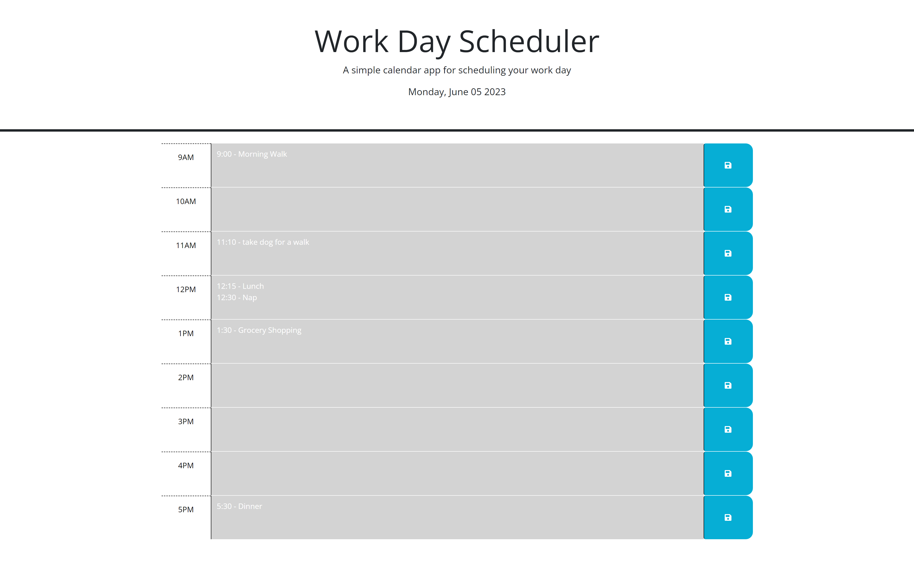

# Work Day Scheduler App

## Description

This application allows you to plan out your day, where you are able to type in notes in each hour timeblock of the day. The application utilizes local storage, so things you input to the app will remain on that window until removed. We were given starter code for this, the main goal for this project was to practice working with various 3rd party APIs such as jQuery, google fonts, Day.js, and more!

## Installation

N/A

## Usage

The hours of the day are divided into timeblocks. You are able to click in the center of any timeblock and add any text to here. Once you are done typing, click the save button to the right of the timeblock. This will save your text to local storage, so it will remain there until removed. Each timeblock is color-coded in regard to the current time. Gray timeblocks mean that hour has been passed, red means the present timeblock, green means the future. The date in the center of the application is the present date.

For your viewing convenience, a screenshot preview of the Work Day Scheduler is attached below this section. Here is a link to the live application: https://halversonm.github.io/work-day-scheduler/

## Credits

N/A

## License

Please refer to the license in the repo.